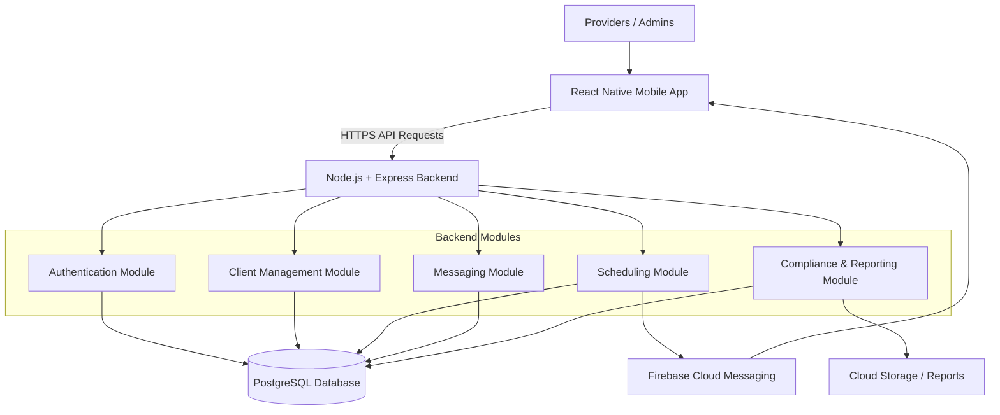
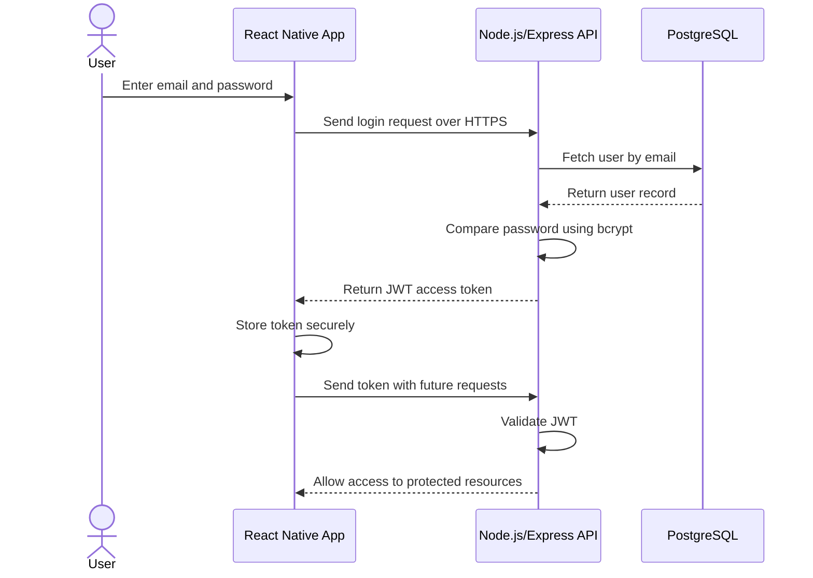
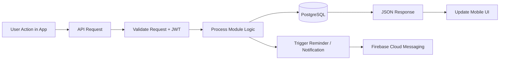
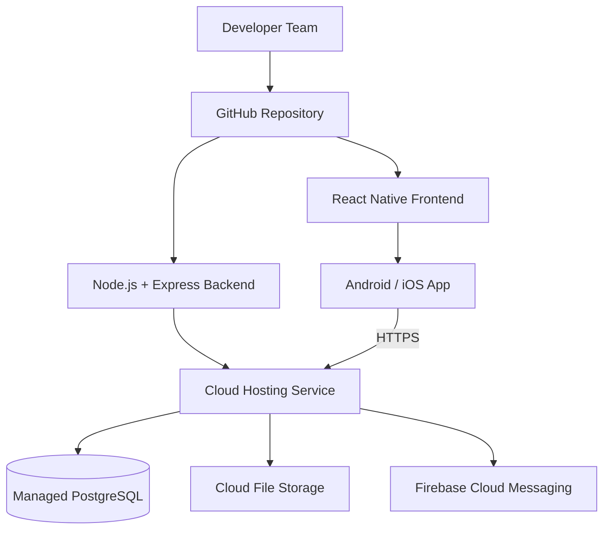

# Week 4 – System Architecture

## NDIS Provider Support Mobile Application (Sydney)

## 1. Introduction

This section presents the system architecture for the **NDIS Provider Support Mobile Application (Sydney)**, a full-stack mobile application designed to support NDIS providers in managing client records, service schedules, communication, and compliance reporting.

The purpose of the architecture is to define how the system will be structured technically, how different components will interact, and how security, scalability, and maintainability will be achieved.

The proposed architecture is designed to meet the project objectives while remaining realistic for a **12-week student development project**.

## 2. Architecture Goal

The goal of the system architecture is to provide a clear technical foundation for building a secure, user-friendly, and scalable mobile solution for Sydney-based NDIS providers.

The architecture must support:

- cross-platform mobile access
- secure authentication and authorisation
- client and service data management
- appointment scheduling and reminders
- communication between users
- compliance reporting and audit support

## 3. Architecture Style

### 3.1 Chosen Architecture

The proposed system will follow a **modular monolithic architecture**.

This means the application will be developed as one deployable backend system, but internally it will be divided into separate functional modules such as authentication, client management, scheduling, messaging, and reporting.

### 3.2 Justification

A modular monolith is the most suitable option for this project because:

- the project duration is limited to **12 weeks**
- the team size is relatively small (**3–5 students**)
- it is easier to design, build, test, and deploy than microservices
- it avoids the complexity of managing multiple services and deployments
- it still provides good separation of concerns within the application

Although microservices can improve scalability in large enterprise systems, they would introduce unnecessary complexity for a student prototype. Therefore, a modular monolith provides a more practical and achievable solution.

## 4. Technology Stack

The technology stack has been selected based on ease of development, compatibility with mobile platforms, scalability, and industry relevance.

### Frontend

**React Native** will be used for the mobile application frontend. This allows the development of a single cross-platform codebase for both **Android and iOS**, reducing development time while still delivering a native-like user experience.

### Backend

**Node.js with Express.js** will be used for backend development. This provides a lightweight and efficient framework for building RESTful APIs and handling client-server communication.

### Database

**PostgreSQL** will be used as the primary database. A relational database is appropriate because the system manages structured and related data such as users, clients, appointments, notes, incident reports, and compliance records.

### Authentication

**JWT-based authentication** with secure password hashing will be implemented. This approach supports secure login, stateless session handling, and role-based access control.

### Cloud / Deployment

The system can be deployed using **AWS** or another suitable cloud platform. For the prototype, backend hosting and database services can be deployed on cloud infrastructure to simulate a production-like environment.

### Notifications

**Firebase Cloud Messaging (FCM)** can be used for mobile notifications such as appointment reminders and alerts.

## 5. High-Level System Structure

The system will follow a **three-layer architecture**:

### 5.1 Presentation Layer

This is the mobile application interface used by providers and administrators. It is responsible for displaying information, collecting user input, and sending requests to the backend.

### 5.2 Application Layer

This is the backend server where business logic is processed. It manages authentication, validation, scheduling, client records, messaging, reporting, and communication with the database.

### 5.3 Data Layer

This layer stores system data in PostgreSQL and manages any files or reports through cloud storage. It ensures data persistence, integrity, and retrieval when needed.

### High-Level System Architecture Diagram

## 6. Major Services and Components

The architecture is divided into the following major components:

### 6.1 Mobile Application

The mobile application is the main user-facing part of the system. It includes screens and features such as:

- login and registration
- user dashboard
- client profile management
- service scheduling
- progress note entry
- incident report form
- report viewing/export
- messaging and notifications

### 6.2 Authentication Module

This module is responsible for:

- user login and logout
- password validation
- token generation and verification
- managing secure access to protected resources

### 6.3 Client Management Module

This module supports:

- registering client profiles
- updating client records
- viewing support plans and care history
- storing client-related documentation

### 6.4 Scheduling Module

This module handles:

- creating and updating appointments
- assigning service times
- storing calendar entries
- sending reminders and notifications

### 6.5 Messaging Module

This module manages communication between users through secure in-app messaging. It stores messages and can trigger alerts when new messages are received.

### 6.6 Compliance and Reporting Module

This module supports:

- progress note creation
- incident reporting
- compliance record tracking
- generation of exportable reports for audit purposes

### 6.7 Database

The database stores all structured records used by the system, including user accounts, client details, appointments, messages, and compliance logs.

## 7. Monolith or Microservices?

The system will be implemented as a **modular monolith**, not as microservices.

### Reason for This Decision

A microservices architecture would require separate deployment pipelines, service discovery, API coordination, and more advanced DevOps management. For a student project with limited time and resources, this would make the system harder to manage.

A modular monolith is a better solution because it:

- keeps development simpler
- supports easier testing and debugging
- allows clear module separation
- can later be expanded into microservices if the application grows

Therefore, the architecture balances practicality and future scalability.

## 8. Authentication Design

Authentication will be implemented using **email and password login**, supported by **JWT tokens**.

### Authentication Process

1. The user enters login credentials in the mobile app.
2. The mobile app sends the credentials securely to the backend API over HTTPS.
3. The backend verifies the email and password.
4. Passwords are compared using bcrypt hashing.
5. If the credentials are valid, the server generates a JWT access token.
6. The mobile application stores the token securely and sends it with future API requests.
7. The backend verifies the token before allowing access to protected endpoints.

### Authentication Flow Diagram

### Access Control

The system will use **role-based access control (RBAC)**.

Example roles may include:

- Admin
- Provider / Support Worker
- Manager

Different roles will have different permissions for viewing, editing, and exporting information.

### Security Features

- password hashing
- HTTPS communication
- token-based session control
- input validation
- access control by role
- secure handling of sensitive records

## 9. Data Flow

The overall data flow of the system will follow a client-server model.

### General Flow

1. The user performs an action in the React Native mobile app.
2. The mobile app sends an API request to the backend server.
3. The backend validates the request and checks authentication.
4. The appropriate module processes the business logic.
5. The backend reads from or writes to the PostgreSQL database.
6. A response is returned to the mobile app in JSON format.
7. The mobile interface updates accordingly.

### Data Flow Diagram

### Example: Appointment Scheduling

- A provider selects a date and time for a service.
- The mobile app sends the appointment request to the scheduling API.
- The backend validates the request and stores the appointment in the database.
- A reminder notification can then be scheduled.
- The updated booking is shown in the calendar screen.

### Example: Incident Reporting

- A provider submits an incident form through the app.
- The backend checks that all required fields are completed.
- The report is stored in the database.
- The system creates an audit log entry for compliance purposes.
- The record becomes available to authorised administrators.

## 10. Database Design Support

The relational database will include core entities such as:

- Users
- Roles
- Clients
- SupportPlans
- Appointments
- Messages
- ProgressNotes
- IncidentReports
- ComplianceLogs
- Reports

A relational design is preferred because the project requires strong consistency, structured relationships, and reliable reporting.

## 11. Security and Privacy Considerations

Because the system handles sensitive personal and health-related service information, privacy and security are essential.

The architecture supports security by including:

- encrypted communication using HTTPS
- secure password hashing
- authenticated API access
- role-based permissions
- audit logs for important actions
- restricted access to sensitive records
- secure database and cloud storage configuration

These controls help protect confidentiality, integrity, and availability of data and support responsible handling of information within an NDIS context.

## 12. Deployment Approach

For deployment, the system can be hosted on a cloud-based platform.

### Proposed Deployment Setup

- **Frontend:** React Native mobile app for Android and iOS
- **Backend:** Node.js + Express API hosted in the cloud
- **Database:** PostgreSQL hosted on a managed cloud service
- **Storage:** Cloud file storage for reports and attachments
- **Notifications:** Firebase Cloud Messaging for reminders and alerts

### Deployment Diagram

This deployment model is suitable for the prototype stage and can be extended later for production use.

## 13. Benefits of the Proposed Architecture

The selected architecture provides several advantages:

- simple and realistic for a student team
- supports both Android and iOS through one frontend codebase
- secure handling of user and client data
- clear separation of system modules
- easier maintenance and testing
- scalable enough for future improvements

## 14. Conclusion

The proposed system architecture for the **Sydney NDIS Provider Mobile App** is a **modular monolithic full-stack architecture** built using **React Native**, **Node.js/Express**, and **PostgreSQL**. This architecture is the most appropriate choice for the size, scope, and duration of the project.

It supports the key functional requirements of client management, scheduling, communication, and compliance reporting, while also addressing important non-functional requirements such as security, maintainability, and scalability. As a result, it provides a strong technical foundation for the successful development of the application.
