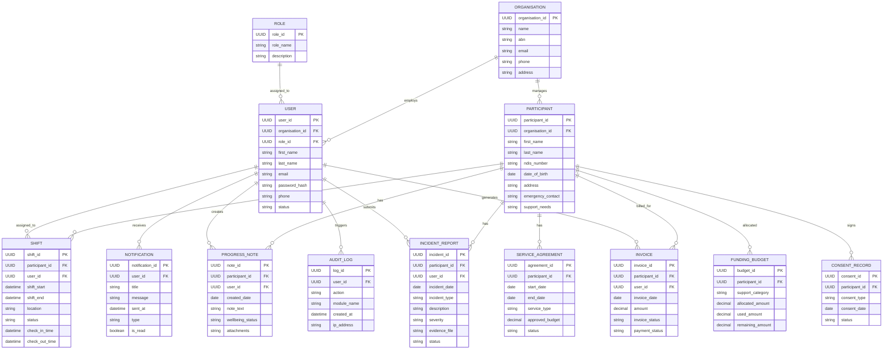
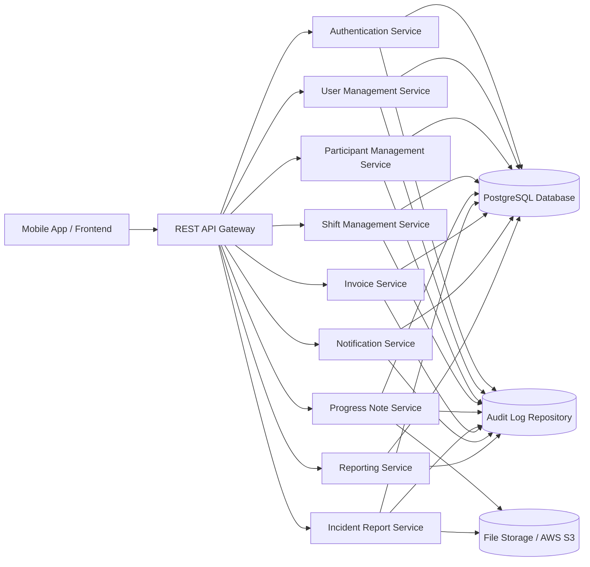

# Week 5 – Database Schema and API Specification

## 1. Introduction
This section presents the **Week 5 deliverable** for the **Sydney NDIS Provider Mobile App (GridLink NDIS)**. The focus of this work is to design the **database schema**, define the **REST APIs**, specify the **validation rules**, and answer the core design questions required for backend implementation.

This deliverable provides the technical foundation for how the system stores data, manages relationships between records, exposes services to the frontend, and maintains data integrity and security.

---

## 2. Deliverable Overview
**Deliverable:** Database Schema and API Specification

This deliverable includes:
- Definition of the main system entities
- Relationships between entities
- Database structure and schema design
- REST API specification for major modules
- Validation rules for secure and accurate data entry
- Supporting diagrams to explain system design and flow

---

## 3. Objectives
The objectives of this section are to:
- Define the main data entities required by the system
- Show the relationships between those entities
- Design a backend data structure that supports core business operations
- Define REST APIs required by the mobile application
- Establish validation rules for correctness, security, and reliability
- Present diagrams that clearly explain the technical structure

---

## 4. Key Design Questions

### 4.1 What entities exist?
The system requires a set of entities to support provider operations, participant care management, scheduling, billing, communication, and compliance. The main entities identified are:

- Organisation
- Role
- User
- Participant
- Service Agreement
- Shift
- Progress Note
- Incident Report
- Invoice
- Funding Budget
- Notification
- Audit Log
- Consent Record

### 4.2 What relationships exist?
These entities are connected to support real-world operations in an NDIS provider environment. For example, one organisation manages many users and participants, one participant can have many shifts and progress notes, and one user may create multiple incident reports or invoices.

### 4.3 What APIs are required?
The application needs APIs for authentication, participant management, shift scheduling, care documentation, incident reporting, invoicing, notifications, reporting, and audit support.

---

# 5. Database Schema Design

## 5.1 Schema Design Approach
The database schema is designed using a **relational model** because the application contains structured data with clear links between users, participants, services, and records. A relational database such as **PostgreSQL** is appropriate because it supports:

- strong data consistency
- structured queries
- foreign key relationships
- transaction support
- scalability for future features

The schema is organised so that each major business object has its own table, with primary keys for identification and foreign keys for relationships.

---

## 5.2 Main Entities and Purpose

| Entity | Purpose |
|---|---|
| Organisation | Stores provider organisation details |
| Role | Stores access roles such as Support Worker, Service Coordinator, Provider Administrator, and System Administrator |
| User | Stores staff and administrator account information |
| Participant | Stores participant personal and NDIS-related details |
| Service Agreement | Stores agreement details between provider and participant |
| Shift | Stores service schedule, assignments, and attendance records |
| Progress Note | Stores care notes and service observations |
| Incident Report | Stores reported incidents and supporting evidence |
| Invoice | Stores billing records generated for services |
| Funding Budget | Stores NDIS funding allocation and usage details |
| Notification | Stores alerts and reminders for users |
| Audit Log | Stores important system actions for security and compliance |
| Consent Record | Stores participant consent and privacy approvals |

---

## 5.3 Database Entity Descriptions

### Organisation
The Organisation entity represents the NDIS provider using the application. It is the top-level business entity that owns users, participants, and operational records.

**Important attributes:**
- organisation_id
- name
- ABN
- email
- phone
- address

### Role
The Role entity defines the permission level of each user in the system.

**Examples:**
- Support Worker
- Service Coordinator
- Provider Administrator
- System Administrator

### User
The User entity stores all staff and admin users who log into the system.

**Important attributes:**
- user_id
- organisation_id
- role_id
- first_name
- last_name
- email
- password_hash
- phone
- status

### Participant
The Participant entity stores information about NDIS participants receiving services.

**Important attributes:**
- participant_id
- organisation_id
- first_name
- last_name
- ndis_number
- date_of_birth
- address
- emergency_contact
- support_needs

### Service Agreement
This entity stores the service agreement between the provider and participant.

### Shift
This entity stores scheduled support sessions and attendance events such as check-in and check-out.

### Progress Note
This entity stores daily support notes and participant care observations entered by support workers.

### Incident Report
This entity stores records of incidents, descriptions, evidence, and severity classifications.

### Invoice
This entity stores billing information for services delivered to participants.

### Funding Budget
This entity stores allocated, used, and remaining budget amounts for participants.

### Notification
This entity stores reminders, alerts, and internal notification messages.

### Audit Log
This entity stores security and activity records for compliance and monitoring.

### Consent Record
This entity stores participant consent related to privacy, information sharing, and service permissions.

---

## 5.4 ER Diagram


---

## 5.5 Relationship Summary
The key relationships in the system are:

- One **Organisation** can have many **Users**
- One **Organisation** can manage many **Participants**
- One **Role** can be assigned to many **Users**
- One **Participant** can have many **Service Agreements**
- One **Participant** can have many **Shifts**
- One **Participant** can have many **Progress Notes**
- One **Participant** can have many **Incident Reports**
- One **Participant** can have many **Invoices**
- One **Participant** can have many **Funding Budgets**
- One **Participant** can have many **Consent Records**
- One **User** can be assigned many **Shifts**
- One **User** can create many **Progress Notes**
- One **User** can submit many **Incident Reports**
- One **User** can generate many **Invoices**
- One **User** can receive many **Notifications**
- One **User** can trigger many **Audit Logs**

---

## 5.6 Simplified Schema Table Examples

### User Table
| Field | Type | Key | Notes |
|---|---|---|---|
| user_id | UUID | PK | Unique identifier |
| organisation_id | UUID | FK | Links to Organisation |
| role_id | UUID | FK | Links to Role |
| first_name | VARCHAR |  | Required |
| last_name | VARCHAR |  | Required |
| email | VARCHAR | Unique | Required |
| password_hash | TEXT |  | Securely stored |
| phone | VARCHAR |  | Optional |
| status | VARCHAR |  | Active / Inactive |

### Participant Table
| Field | Type | Key | Notes |
|---|---|---|---|
| participant_id | UUID | PK | Unique identifier |
| organisation_id | UUID | FK | Links to Organisation |
| first_name | VARCHAR |  | Required |
| last_name | VARCHAR |  | Required |
| ndis_number | VARCHAR | Unique | Required |
| date_of_birth | DATE |  | Required |
| address | TEXT |  | Optional |
| emergency_contact | VARCHAR |  | Required |
| support_needs | TEXT |  | Required |

### Shift Table
| Field | Type | Key | Notes |
|---|---|---|---|
| shift_id | UUID | PK | Unique identifier |
| participant_id | UUID | FK | Links to Participant |
| user_id | UUID | FK | Assigned worker |
| shift_start | TIMESTAMP |  | Required |
| shift_end | TIMESTAMP |  | Required |
| location | VARCHAR |  | Required |
| status | VARCHAR |  | Scheduled / Completed / Cancelled |
| check_in_time | TIMESTAMP |  | Optional |
| check_out_time | TIMESTAMP |  | Optional |

---

# 6. REST API Design

## 6.1 API Design Approach
The application uses a **REST API architecture** to allow the mobile frontend to communicate with backend services. REST APIs are appropriate because they are simple, scalable, easy to integrate, and widely supported across mobile and web platforms.

Each major module has its own endpoint group. These APIs are designed to:
- create records
- retrieve records
- update records
- delete or deactivate records
- support secure access control
- enable smooth communication between frontend and backend

---

## 6.2 API Architecture Diagram


---

## 6.3 Required APIs
The main APIs required by the system are:

- Authentication API
- User Management API
- Participant Management API
- Shift Management API
- Progress Note API
- Incident Report API
- Invoice API
- Notification API
- Reporting API
- Audit Support API

---

## 6.4 REST API Endpoints

### Authentication API
| Method | Endpoint | Purpose |
|---|---|---|
| POST | `/api/auth/register` | Register a new user |
| POST | `/api/auth/login` | Authenticate a user |
| POST | `/api/auth/logout` | Logout current user |
| POST | `/api/auth/forgot-password` | Request password reset |
| POST | `/api/auth/reset-password` | Reset password |
| POST | `/api/auth/verify-2fa` | Verify two-factor authentication |

### User Management API
| Method | Endpoint | Purpose |
|---|---|---|
| GET | `/api/users` | Retrieve all users |
| GET | `/api/users/{id}` | Retrieve user by ID |
| POST | `/api/users` | Create a new user |
| PUT | `/api/users/{id}` | Update user details |
| DELETE | `/api/users/{id}` | Deactivate a user |

### Participant Management API
| Method | Endpoint | Purpose |
|---|---|---|
| GET | `/api/participants` | Retrieve all participants |
| GET | `/api/participants/{id}` | Retrieve participant by ID |
| POST | `/api/participants` | Create participant |
| PUT | `/api/participants/{id}` | Update participant |
| DELETE | `/api/participants/{id}` | Remove or deactivate participant |

### Shift Management API
| Method | Endpoint | Purpose |
|---|---|---|
| GET | `/api/shifts` | Retrieve all shifts |
| GET | `/api/shifts/{id}` | Retrieve shift by ID |
| POST | `/api/shifts` | Create shift |
| PUT | `/api/shifts/{id}` | Update shift |
| POST | `/api/shifts/{id}/check-in` | Record worker check-in |
| POST | `/api/shifts/{id}/check-out` | Record worker check-out |

### Progress Note API
| Method | Endpoint | Purpose |
|---|---|---|
| GET | `/api/progress-notes` | Retrieve progress notes |
| GET | `/api/progress-notes/{id}` | Retrieve progress note by ID |
| POST | `/api/progress-notes` | Create progress note |
| PUT | `/api/progress-notes/{id}` | Update progress note |
| DELETE | `/api/progress-notes/{id}` | Delete progress note |

### Incident Report API
| Method | Endpoint | Purpose |
|---|---|---|
| GET | `/api/incidents` | Retrieve incident reports |
| GET | `/api/incidents/{id}` | Retrieve incident by ID |
| POST | `/api/incidents` | Submit incident report |
| PUT | `/api/incidents/{id}` | Update incident report |
| POST | `/api/incidents/{id}/attachments` | Upload evidence file |

### Invoice API
| Method | Endpoint | Purpose |
|---|---|---|
| GET | `/api/invoices` | Retrieve invoices |
| GET | `/api/invoices/{id}` | Retrieve invoice by ID |
| POST | `/api/invoices` | Generate invoice |
| PUT | `/api/invoices/{id}` | Update invoice |
| GET | `/api/invoices/participant/{participantId}` | Retrieve invoices by participant |

### Notification API
| Method | Endpoint | Purpose |
|---|---|---|
| GET | `/api/notifications` | Retrieve notifications |
| PUT | `/api/notifications/{id}/read` | Mark notification as read |
| POST | `/api/notifications` | Send notification |

### Reporting API
| Method | Endpoint | Purpose |
|---|---|---|
| GET | `/api/reports/operations` | Generate operational report |
| GET | `/api/reports/budget` | Generate budget report |
| GET | `/api/reports/incidents` | Generate incident summary |
| GET | `/api/reports/invoices` | Generate billing report |

---

## 6.5 Example API Workflow Diagram
```mermaid
sequenceDiagram
    actor SupportWorker
    participant App as Mobile App
    participant API as REST API
    participant Auth as Auth Service
    participant Note as Progress Note Service
    participant DB as PostgreSQL

    SupportWorker->>App: Enter progress note details
    App->>API: POST /api/progress-notes
    API->>Auth: Verify token and role
    Auth-->>API: Access granted
    API->>Note: Process note request
    Note->>DB: Save progress note
    DB-->>Note: Save successful
    Note-->>API: Return response
    API-->>App: 201 Created
    App-->>SupportWorker: Progress note submitted
```

---

# 7. Validation Rules

## 7.1 Validation Purpose
Validation ensures that the data entered into the system is complete, accurate, secure, and logically correct. It reduces system errors, improves reliability, and protects sensitive participant and provider information.

Validation should be applied at both:
- frontend level for user guidance
- backend level for security and data integrity

---

## 7.2 General Validation Rules
The system should enforce the following general rules:

- Required fields must not be left empty
- IDs must be valid and unique
- Email addresses must follow a valid format
- Dates must be valid and logically correct
- Numeric values must not be negative unless explicitly allowed
- Uploaded files must meet file type and size limits
- Input lengths should be controlled to prevent invalid or harmful data
- Only authorised users should access protected functions

---

## 7.3 Entity-Specific Validation

### User Validation
- first_name is required
- last_name is required
- email is required and must be unique
- password must meet strength requirements
- role_id must refer to a valid role
- organisation_id must refer to a valid organisation

### Participant Validation
- first_name is required
- last_name is required
- ndis_number is required and must be unique
- date_of_birth must be valid
- emergency_contact is required
- organisation_id must be valid

### Shift Validation
- participant_id must exist
- user_id must exist
- shift_start is required
- shift_end is required
- shift_end must be later than shift_start
- check_out_time cannot be earlier than check_in_time

### Progress Note Validation
- participant_id must exist
- user_id must exist
- note_text must not be empty
- only authorised roles can create or edit notes

### Incident Report Validation
- participant_id must exist
- user_id must exist
- incident_date is required
- description is required
- severity must match allowed values
- evidence file must meet allowed file rules

### Invoice Validation
- participant_id must exist
- amount must be greater than zero
- invoice_date is required
- payment_status must match defined values

### Funding Budget Validation
- allocated_amount must not be negative
- used_amount must not be negative
- remaining_amount should be calculated correctly

---

# 8. Security and Technical Considerations
The backend design should also support security and compliance requirements.

### Important considerations
- Use **JWT authentication** for session security
- Support **two-factor authentication** for sensitive user access
- Apply **role-based access control (RBAC)**
- Use **HTTPS/TLS** for secure data transmission
- Store uploaded evidence files securely
- Record important activities in the **Audit Log**
- Protect sensitive participant information with access restrictions
- Validate all incoming API requests before database actions

---

# 9. Summary
In Week 5, the backend structure for the GridLink NDIS application was defined through the design of the **database schema**, **REST APIs**, and **validation rules**. The main entities, their relationships, and required APIs were identified to support participant management, scheduling, care documentation, incident handling, billing, notifications, and reporting. The included diagrams provide a clear visual explanation of how the data model and API structure work together to support the application.

This deliverable forms a strong foundation for future backend development and implementation.
